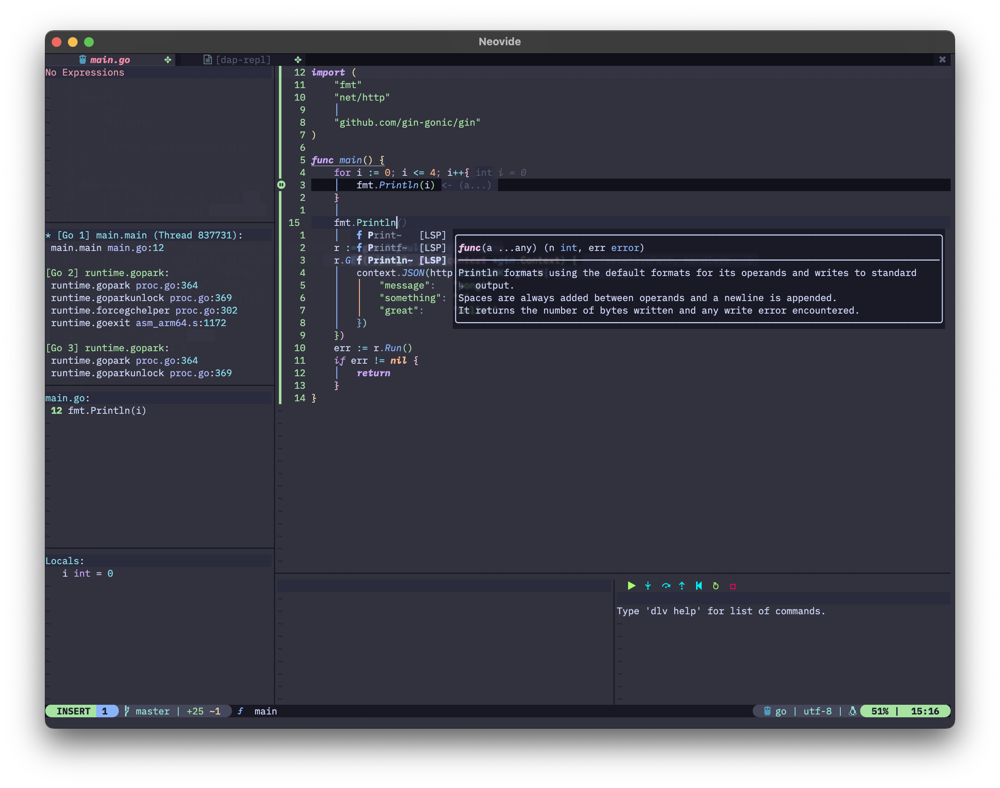

# Usage

This repo is mainly for my backup. It works well on my Mac and PC. Installation is quite easy. Just make sure you have `git` installed in PATH, clone this repo, and open `nvim`. 

## Some Nice Screenshots

### Overall Showcase

